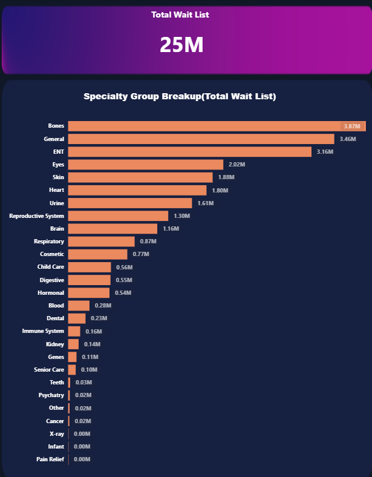

# 🏥 Healthcare Patient Waitlist Analytics Dashboard
An interactive Power BI dashboard for analyzing healthcare patient wait lists, specialty trends, age profiles, and monthly performance using DAX, Power Query, and data visualization.

## 📌 Project Overview
This project presents an interactive Healthcare Patient Waitlist Dashboard developed using Microsoft Power BI. The objective is to analyze patient waiting lists across multiple specialties, case types, age groups, and time periods to support data-driven healthcare decision-making.

The dashboard enables healthcare stakeholders to monitor patient demand, identify bottlenecks, analyze historical trends, and improve resource planning through interactive visualizations.

## 🎯 Business Problem
Healthcare organizations need better visibility into patient waiting lists to improve service delivery and reduce delays.

This dashboard helps answer questions such as:

• How many patients are currently waiting?

• Which specialties have the longest waiting lists?

• Which age groups experience longer waiting times?

• How have waiting lists changed over time?

• Which patient category contributes the most to the waiting list?

# 📊 Dashboard Pages

<h2>1️⃣ Executive Summary Dashboard</h2>

    

#### Description:
Provides a high-level overview of patient waitlist performance using KPIs, trend analysis, specialty distribution, and age profile segmentation.

#### Main KPIs
    Current Wait List
    Previous Year Wait List
    Average Wait List
    Median Wait List
    Monthly Trends
    Age Profile
    Specialty Ranking

<h2>2️⃣ Detailed View</h2>

    

#### Description:
Provides granular analysis of patient waitlists with dynamic filtering across specialty, age group, time band, and case type.

#### Includes
    Dynamic Table
    Drill-through
    Detailed Metrics
    Interactive Filtering

<h2>3️⃣ Specialty Analysis(Drill Down)</h2>

    

#### Description:
    Provides specialty-wise comparison of patient waiting lists to identify departments with the highest patient demand.

## 📈 Key Insights
• Total Patient Waitlist exceeded 25 Million records.

• Outpatient category contributes over 72% of the total waitlist.

• Orthopaedics and General specialties have the highest patient volume.

• Average waiting time is highest for patients waiting over 18 months.

• Monthly trends show increasing outpatient demand after 2019.

## 🛠 Tools & Technologies
Microsoft Power BI

Power Query

DAX

Excel

Data Modeling

Interactive Dashboard

Data Visualization

## 📚 Skills Demonstrated
✔ Data Cleaning

✔ Data Transformation

✔ Data Modeling

✔ DAX

✔ Power Query

✔ Dashboard Design

✔ Business Intelligence

✔ KPI Reporting

✔ Healthcare Analytics

✔ Data Visualization

✔ Interactive Filtering

✔ Drill Down Analysis

✔ Trend Analysis

## 📂 Dataset
Healthcare Patient Waitlist Dataset

Time Period:
2018–2021

Categories

• Outpatient

• Day Case

• Inpatient

## 📈 KPIs
Latest Month Waitlist

Previous Year Waitlist

Average Waitlist

Median Waitlist

Total Waitlist

Specialty Distribution

Age Profile Analysis

Monthly Trend Analysis

## 📌 DAX Measures Used
Latest Month Wait List

Previous Year Wait List

Average Wait List

Median Wait List

Total Wait List

Dynamic Filters

Time Intelligence

## 📷 Dashboard Preview
### 🏠 Executive Summary Dashboard

Provides an overview of patient waitlists with KPIs, trends, specialty analysis, age profile segmentation, and interactive filters.

  

---

### 📊 Detailed Analysis Dashboard

Enables detailed exploration of patient waitlists with drill-through capabilities, filters, and tabular analysis.

  

---

### 📈 Specialty Analysis Dashboard

Highlights specialty-wise patient waitlists, helping identify departments with the highest patient demand.

  

## 🚀 Business Value
This dashboard helps healthcare administrators monitor patient demand, identify high-pressure specialties, evaluate waiting trends, and support resource planning through interactive business intelligence.

## 👨‍💻 Author
Vikash Basfore

Aspiring Data Analyst | Data Scientist | AI/ML Engineer

Python | SQL | Power BI | Machine Learning | Generative AI

