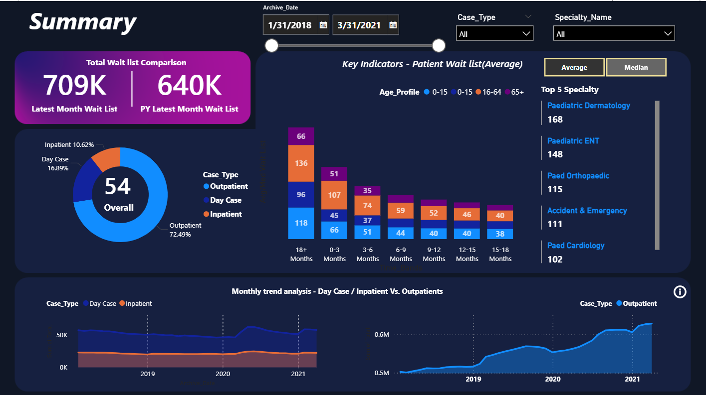

# 🏥 Healthcare Patient Waitlist Analytics Dashboard
An interactive Power BI dashboard for analyzing healthcare patient wait lists, specialty trends, age profiles, and monthly performance using DAX, Power Query, and data visualization.

## 📌 Project Overview
This project presents an interactive Healthcare Patient Waitlist Dashboard developed using Microsoft Power BI. The objective is to analyze patient waiting lists across multiple specialties, case types, age groups, and time periods to support data-driven healthcare decision-making.

The dashboard enables healthcare stakeholders to monitor patient demand, identify bottlenecks, analyze historical trends, and improve resource planning through interactive visualizations.

## 🎯 Business Problem
Healthcare organizations need better visibility into patient waiting lists to improve service delivery and reduce delays.

This dashboard helps answer questions such as:

• How many patients are currently waiting?

• Which specialties have the longest waiting lists?

• Which age groups experience longer waiting times?

• How have waiting lists changed over time?

• Which patient category contributes the most to the waiting list?

# 📊 Dashboard Pages

## 1️⃣ Executive Summary Dashboard

